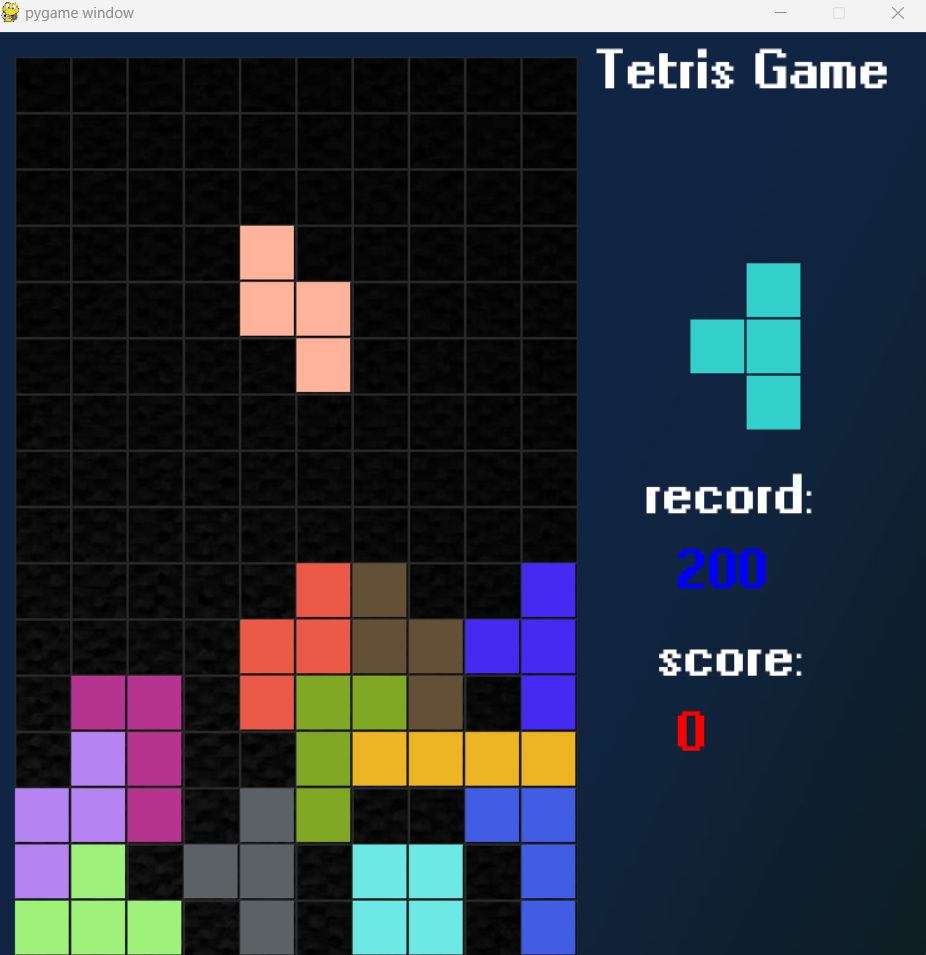

# _Tetris_Game

# Tetris Game Project

## Introduction

This project is a basic implementation of the Tetris game using the Pygame library. Tetris is a classic puzzle game that involves arranging falling blocks to create complete rows.

**Project Structure:**
- **background:** Contains background images for the game.
- **fonts:** Includes fonts used in the game.
- **play_game.py:** Main script for running the Tetris game.
- **record_game_score:** File to record and store game scores.

## Installation

Make sure you have Python and Pygame installed. 

### Controls
- Move Left: `LEFT` arrow key.
- Move Right: `RIGHT` arrow key.
- Rotate: `UP` arrow key.
- Accelerate Down: `DOWN` arrow key.
- Quit: `Q` key.

High Scores
View and beat the highest scores recorded in the game!

This challenge corresponds to the Coding Challenges by John Crickett https://codingchallenges.fyi/challenges/challenge-tetris.

